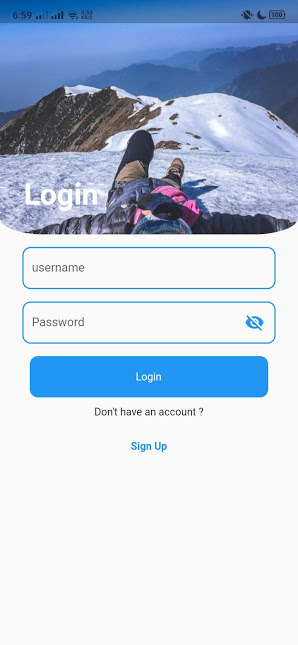
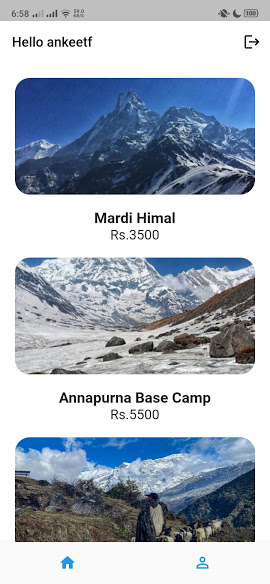
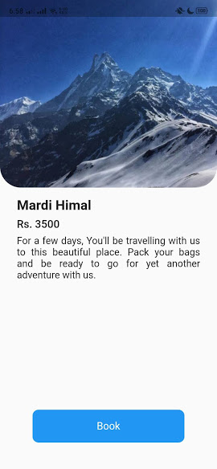

# travelapp

An app to book places for travelling.

`git clone https://github.com/ankeet7x/travelapp`

`cd travelapp`

`flutter pub get`

`flutter run`

### Some Screenshots
  

The images are from https://www.instagram.com/travelspree_/
